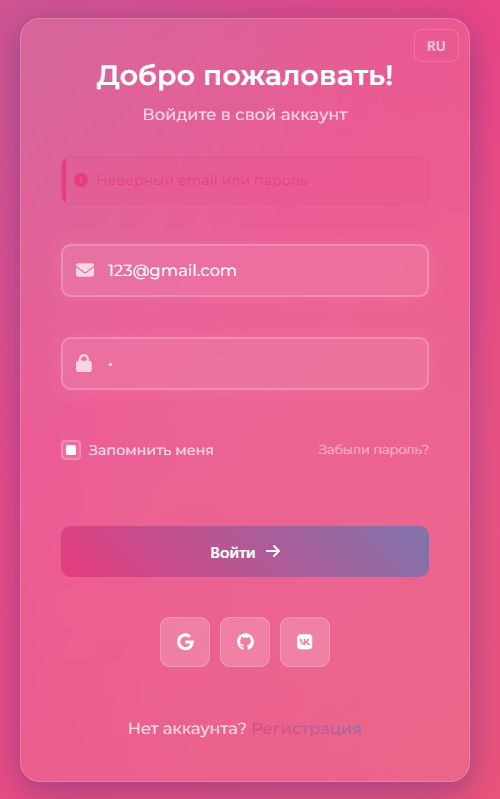

# Modern Authentication System | Современная Система Аутентификации

[English](#english) | [Русский](#русский)

<a name="english"></a>
## 🌟 Modern Authentication System

A modern, responsive authentication system built with React and TypeScript. This project showcases a beautiful user interface with smooth animations and transitions, perfect for modern web applications.

### Features

- **User Authentication**
  - Login with email/password
  - User registration
  - Password recovery system
  - Protected routes

- **Modern UI/UX**
  - Smooth page transitions
  - Responsive design
  - Beautiful gradient animations
  - Form validation with error messages

- **Internationalization**
  - Multi-language support (English/Russian)
  - Easy language switching

### Technologies Used

- **Frontend:**
  - React 18
  - TypeScript
  - React Router v7
  - Material-UI
  - i18next for translations
  - CSS Modules

### Screenshots

#### Login Page


#### Registration Page


#### Password Recovery


#### Form Validation


### Installation and Setup

1. Clone the repository:
```bash
git clone https://github.com/qloux/modern-auth-system.git
```

2. Install dependencies:
```bash
cd frontend
npm install
```

3. Start the development server:
```bash
npm start
```

4. Open http://localhost:3000 in your browser

---

<a name="русский"></a>
## 🌟 Современная Система Аутентификации

Современная, адаптивная система аутентификации, построенная на React и TypeScript. Этот проект демонстрирует красивый пользовательский интерфейс с плавными анимациями и переходами, идеально подходящий для современных веб-приложений.

### Возможности

- **Аутентификация пользователей**
  - Вход по email/паролю
  - Регистрация пользователей
  - Система восстановления пароля
  - Защищенные маршруты

- **Современный UI/UX**
  - Плавные переходы между страницами
  - Адаптивный дизайн
  - Красивые градиентные анимации
  - Валидация форм с сообщениями об ошибках

- **Интернационализация**
  - Поддержка нескольких языков (английский/русский)
  - Удобное переключение языков

### Использованные технологии

- **Frontend:**
  - React 18
  - TypeScript
  - React Router v7
  - Material-UI
  - i18next для переводов
  - CSS Modules

### Скриншоты

#### Страница входа


#### Страница регистрации


#### Восстановление пароля


#### Валидация форм


### Установка и запуск

1. Клонируйте репозиторий:
```bash
git clone https://github.com/qloux/modern-auth-system.git
```

2. Установите зависимости:
```bash
cd frontend
npm install
```

3. Запустите сервер разработки:
```bash
npm start
```

4. Откройте http://localhost:3000 в браузере

## 🔒 Security Features

- Password hashing with bcrypt
- JWT token authentication
- Protected API routes
- Form validation
- CORS protection
- HTTP-only cookies

## 🎨 Design Features

- Responsive design for all screen sizes
- Smooth page transitions
- Interactive form elements
- Loading states and animations
- Error handling UI
- Dark theme support
- Gradient backgrounds

## 👤 Author

**qloux**
- GitHub: [@qloux](https://github.com/qloux)

## 📄 License

This project is licensed under the MIT License.
